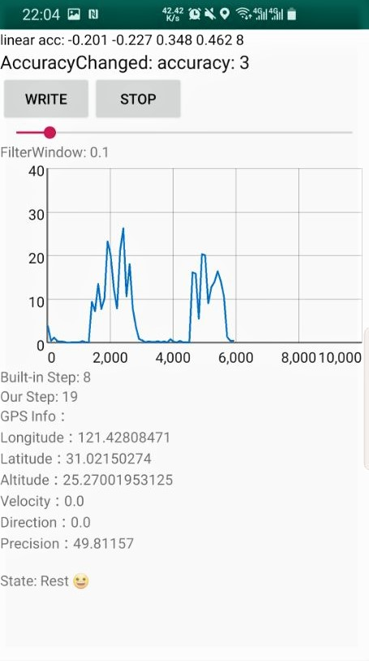
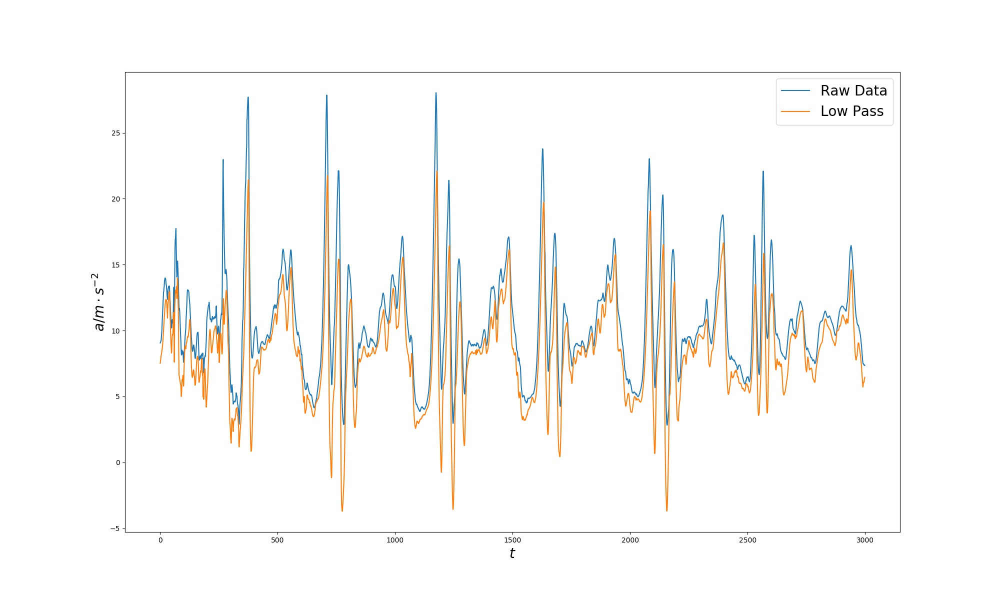
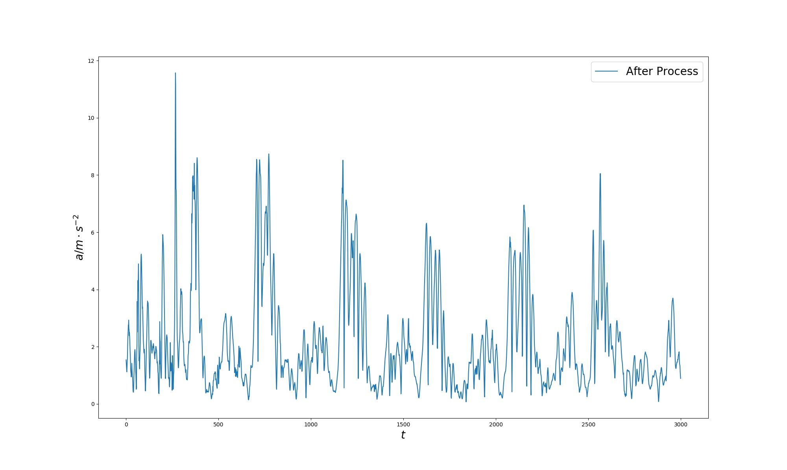

# Android Pedometer

## Implementation

Based on provided Android codes, we build our own pedometer app. In this app, we can directly see how acceleration changes both in scaler view and graph view. 

To obtain better performance, we directly use `sensor.TYPE_LINEAR_ACCELERATION` API, rather than doing low pass filtering. (actually `TYPE_LINEAR_ACCELERATION` has better effect than our handmade low pass filtering)

To derive the step count based the changes of acceleration, we designed the following algorithm:

1. constantly detecting the peak & valley of acceleration curve.
2. if the peak is found, and the gap between peak and valley is lager than a `accThreshold`while the time interval between 2 adjacent peaks is also large than a `timeThreshold` (here is 0.4s), then a step is detected.
3. for the peak-valley pair smaller than the `accThreshold`, we add the value of this gap to a fix-sized list for dynamically updating `accThreshold` (a simple averaging and resizing process).

For testing, the also include the Android built-in step-counting API implemented by sensor hub, an embedded chipset on SOC, for comparison. Normal walking tests shows almost no difference between 2 metrics.

A DEMO snapshot:




## Questions

1. Why we need low pass filtering when we measure the acceleration ?
   What are the differences made by the filtering? Make a contrast.

   **Answer:** 

   a. Reason for low pass filtering: 

   * Low pass filter passes low-frequency signals and reduces the amplitude of signals with frequencies higher than the threshold frequency. 
   * We first do low pass filter to smooth the raw data curve，trying to make the filtered data mainly affected by the gravity. 
   * After the low pass filtering, we subtract the smoothed data from the raw data. In this way we can amplify the signals caused by the human relatively high frequency motions.
   * Using uniformed data could help the step calculation later.

   b. Differences:

   * Figures below show the function of low pass filtering. (plotted by script plot.py)

   

   

2. Can we estimate the stride length using the acceleration oscillogram?

   **Answer:**

   Assume we already have the data saved, which include accelerations on the three axis: 
      $A_x = [ax_1, ax_2, ...]$, 
      $A_y = [ay_1, ay_2, ...]$, 
      $A_z = [az_1, az_2, ...]$, 
      and the time when these data are captured: 
      $t = [t_0, t_1, ...]​$. 

      Note that if we consider the movement of the phone as simple harmonic motion, the ridges(valley) in the curve of acceleration correspond to points when the velocity is zero. That information is essential when we calculate the displacement. We consider two neighbour ridges. The people who carried the phone finished one whole step between these two points. What we need to do is to calculate the horizontal distance the phone moved between pairs of two neighbour ridges and take the average.

      And because the expectation value of vertical distance is `0`, we can use the total distance to estimate the horizontal distance, which eliminates the effects of the uncertainty of phone's position.

      We assume `n` data points are recorded in this period. Via some simple physical induction, we know the distance our phone moved in $x$, $y$, $z$ axis is:
   $$
   d_x = \sum_{i=1}^{n-1} 1/2 ax_i (t_{i+1} - t_i)^2 
   $$

   $$
   d_y = \sum_{i=1}^{n-1} 1/2 ay_i (t_{i+1} - t_i)^2
   $$
   $$
   d_z = \sum_{i=1}^{n-1} 1/2 az_i (t_{i+1} - t_i)^2
   $$

      Then the total distance can be derived as : $d = \sqrt{d_x^2 + d_y^2 + d_z^2}$.

      The step distance is $1/T \sum_{i=0}^T d_i$, where $T$ is the total number of neighbor ridge-ridge pairs we recorded.

3. What’s the meaning of using `super.onPause()` ?

   **Answer**

   If an app needs to be paused, it should first call the superclass method `onPause()` to finish some necessary memory/allocation/scheduling operations to make sure the app could be successfully paused. After that, app can also do other operations related to current class level. 

## Extended Problem

1. Suppose a driver uses an Android mobile. Use the GPS data and acceleration data to judge the switch of the moving and rest states and upload the status
   information to the server.

   **Answer:**

   We use a naive method to judge the state of users by on acceleration and GPS data.

   Based on our pedometer, we judge the users' state every second by checking the location movements by GPS data and number of step taken in a time sliding window.

   The detailed logics are as follows:

   ```java
   if((!location_prev_30sec.isEmpty() 				&&location_prev_30sec.element().distanceTo(location_now)<30)
      	|| step_queue_prev_30sec.size()<7)
       ST.setText("State: Rest 😀");
   else
       ST.setText("State: Moving 🙃");
   ```

   The testing results are pretty good for judging human's state.

   

2. Suppose there are a great number of drivers using the app mentioned in the 1st problem. How could we judge the traffic light’s color using these information? Design and build a system to realize this function.

   **Answers:**

   - locate the position of red-green lights
       1. For each car, we draw its trajectory based on the GPS data recorded. And then we deduct positions of potential red-green lights with the acceleration.
           - Specifically, once the state of the car turns 'rest' and stayed for a while, we infer that it runs into a red-green light.
       2. We process all cars' data using 1 and then mark all potential red-green lights and roads.
       3. Finally, we select out the real positions of red-green lights and the roads between them with clustering algorithm.

   - Infer the red-green light status.
       1. Now we already have the deducted real locations of red-green lights. Then for each location at any time, we analysis the portion of cars that stay 'rest' status near this position. If the portion is larger than some threshold, we can tell that the light is red.

   